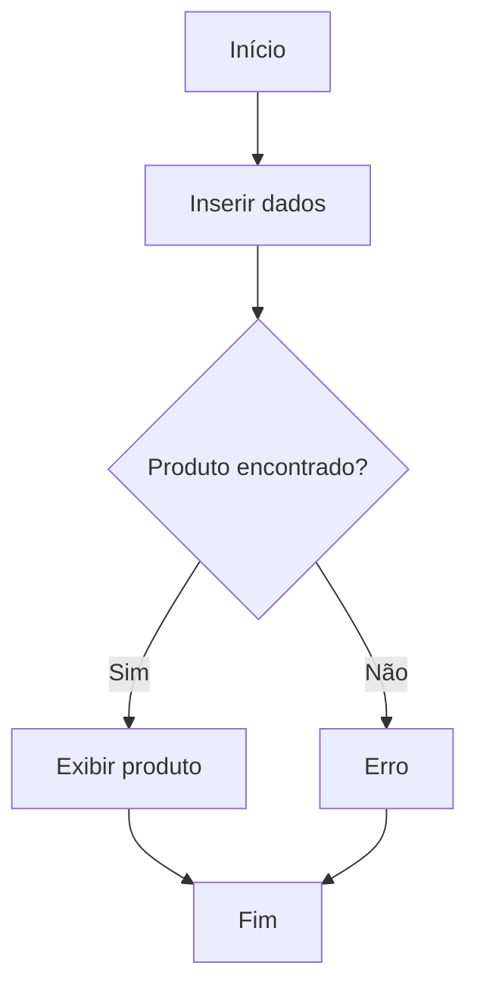
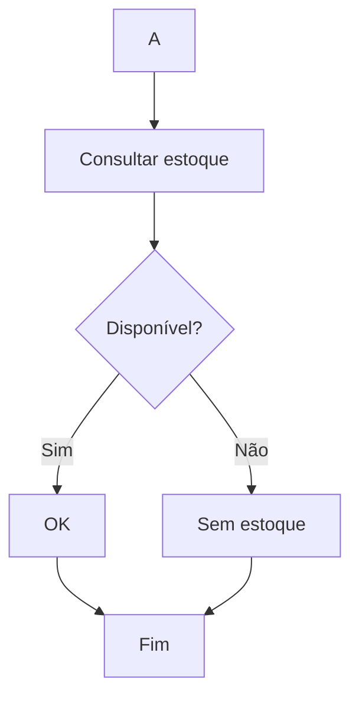
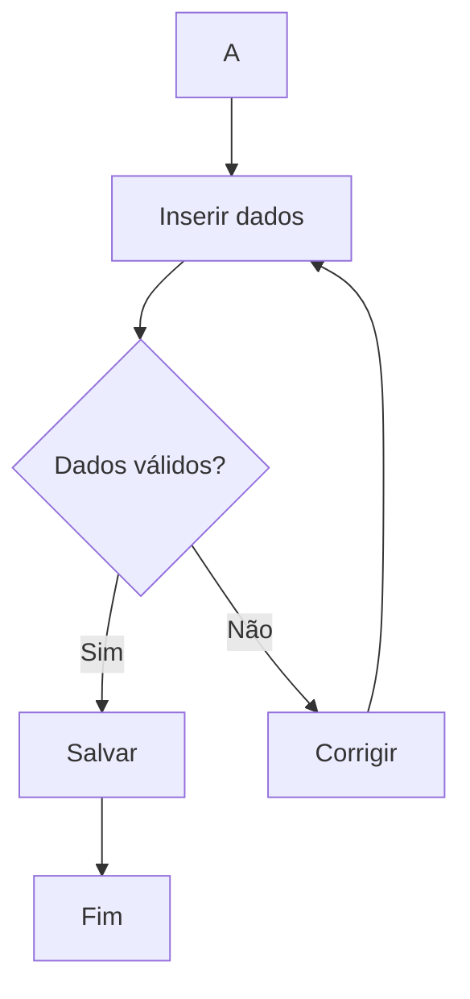
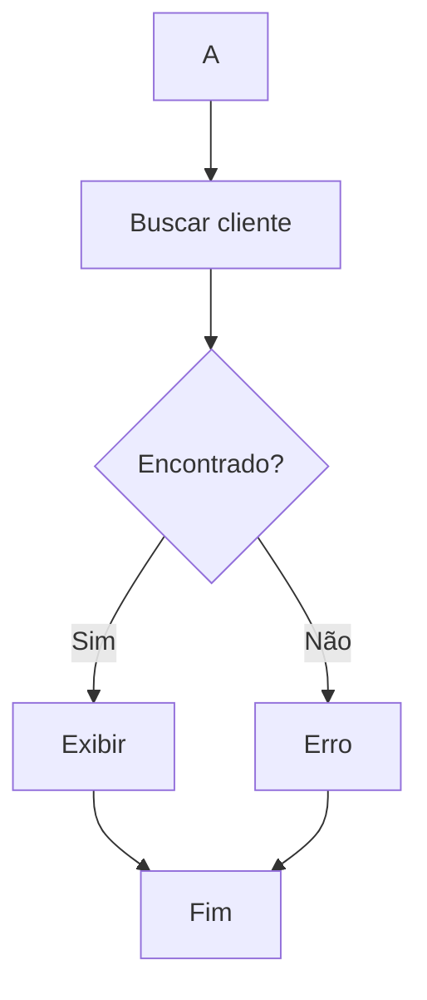
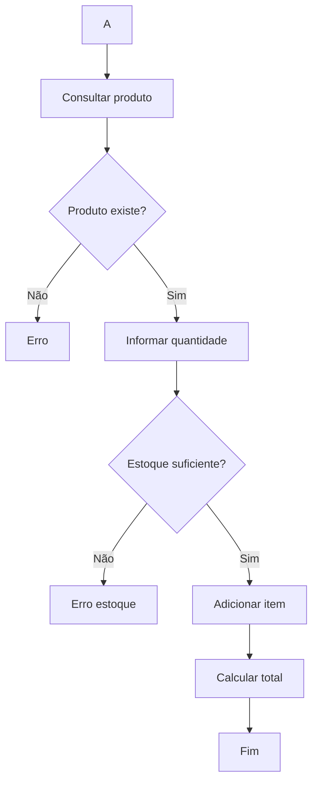
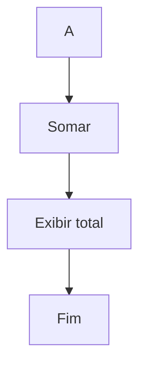
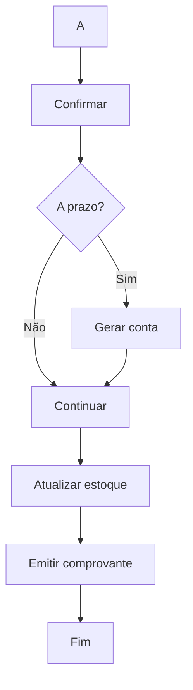
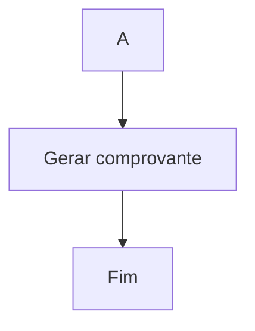
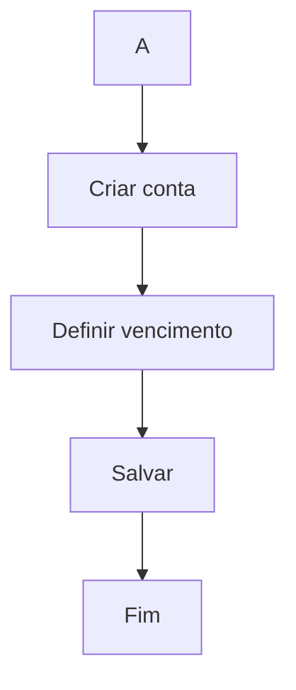
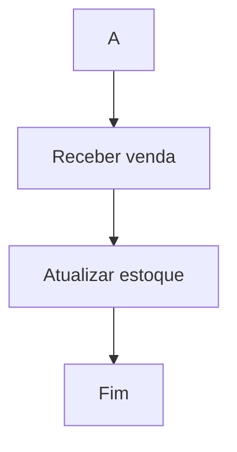

# Avaliação — Engenharia de Software

## Sistema Integrado de Gestão de Farmácia — MVP

**Aluno:** João Victor Rocha Avello Correia
**RA:** 24001368
**Data:** 26/03/2026

---

> ⚠️ Este projeto utiliza Mermaid para renderização dos diagramas diretamente no GitHub.

---

# 1. Definição do MVP

Meu MVP cobre o processo de venda de produtos, desde a identificação/cadastro do cliente até a finalização da venda, incluindo:

* Consulta de produtos
* Verificação de estoque
* Registro de venda
* Atualização automática do estoque
* Emissão de comprovante
* Registro de contas a receber (para vendas a prazo)

## ✅ Dentro do MVP

* Venda à vista e a prazo
* Cadastro de cliente
* Consulta de produtos
* Controle de estoque básico
* Geração de comprovante
* Integração com contas a receber

## ❌ Fora do MVP

* Gestão de fornecedores
* Compras e contas a pagar
* Relatórios avançados
* Controle de múltiplas unidades
* Sistema completo de permissões

## 🎯 Justificativa

O foco no processo de vendas foi escolhido por ser o núcleo do sistema, concentrando a maior parte das operações e integrações críticas.

---

# 2. Regras de Negócio

* **RN01 — Venda condicionada ao estoque:** Produtos só podem ser vendidos se houver quantidade disponível
* **RN02 — Atualização automática:** Toda venda reduz o estoque automaticamente
* **RN03 — Cadastro obrigatório:** Venda a prazo exige cliente cadastrado
* **RN04 — Conta a receber:** Venda a prazo gera registro financeiro automático
* **RN05 — Comprovante obrigatório:** Toda venda deve gerar comprovante
* **RN06 — Produto válido:** Não é permitido vender produtos inexistentes

---

# 3. Requisitos Funcionais

* **RF01:** Consultar produto
* **RF02:** Verificar estoque
* **RF03:** Cadastrar cliente
* **RF04:** Registrar venda
* **RF05:** Calcular total da venda
* **RF06:** Finalizar venda
* **RF07:** Atualizar estoque
* **RF08:** Emitir comprovante
* **RF09:** Registrar venda a prazo
* **RF10:** Consultar cliente

---

# 4. Requisitos Não Funcionais

* **RNF01:** Tempo de resposta inferior a 2 segundos
* **RNF02:** Acesso apenas mediante autenticação
* **RNF03:** Interface simples e intuitiva
* **RNF04:** Integridade e segurança dos dados
* **RNF05:** Disponibilidade durante horário comercial

---

# 5. Casos de Uso

## 🎭 Atores

* Atendente
* Cliente

## 📌 Casos de Uso

* UC01 — Consultar Produto
* UC02 — Verificar Estoque
* UC03 — Cadastrar Cliente
* UC04 — Consultar Cliente
* UC05 — Registrar Venda
* UC06 — Calcular Total
* UC07 — Finalizar Venda
* UC08 — Emitir Comprovante
* UC09 — Registrar Venda a Prazo
* UC10 — Atualizar Estoque

## 🔗 Relacionamentos

### Includes

* UC05 → UC01
* UC05 → UC06
* UC07 → UC08

### Extends

* UC03 → UC05
* UC09 → UC07
* UC02 → UC05

---

# 6. Documentação dos Casos de Uso

---

## UC01 — Consultar Produto

**Ator(es):** Atendente
**Descrição:** Permite buscar um produto no sistema
**Pré-condições:** Sistema ativo
**Pós-condições:** Produto exibido

### Fluxo Principal

1. Inserir dados do produto
2. Sistema realiza busca
3. Sistema exibe resultado

### Fluxos Alternativos

* **FA01:** Produto não encontrado
* **FA02:** Entrada inválida

### Diagrama

---

## UC02 — Verificar Estoque

**Ator(es):** Sistema
**Descrição:** Verifica disponibilidade do produto

### Fluxo Principal

1. Receber produto
2. Consultar estoque
3. Retornar quantidade

### Fluxos Alternativos

* **FA01:** Estoque zerado

### Diagrama

---

## UC03 — Cadastrar Cliente

**Ator(es):** Atendente

### Fluxo Principal

1. Inserir dados
2. Validar dados
3. Salvar cliente

### Diagrama

---

## UC04 — Consultar Cliente

**Ator(es):** Atendente

### Fluxo Principal

1. Buscar cliente
2. Exibir dados

### Diagrama

---

## UC05 — Registrar Venda

**Ator(es):** Atendente

### Fluxo Principal

1. Iniciar venda
2. Consultar produto
3. Informar quantidade
4. Verificar estoque
5. Adicionar item
6. Calcular total

### Fluxos Alternativos

* **FA01:** Produto inexistente
* **FA02:** Estoque insuficiente

### Diagrama

---

## UC06 — Calcular Total

**Ator(es):** Sistema

### Fluxo Principal

1. Somar valores
2. Exibir total

### Diagrama

---

## UC07 — Finalizar Venda

**Ator(es):** Atendente

### Fluxo Principal

1. Confirmar venda
2. Atualizar estoque
3. Emitir comprovante

### Fluxos Alternativos

* **FA01:** Venda a prazo

### Diagrama

---

## UC08 — Emitir Comprovante

**Ator(es):** Sistema

### Fluxo Principal

1. Gerar comprovante

### Diagrama

---

## UC09 — Registrar Venda a Prazo

**Ator(es):** Sistema

### Fluxo Principal

1. Criar conta
2. Definir vencimento
3. Salvar

### Diagrama

---

## UC10 — Atualizar Estoque

**Ator(es):** Sistema

### Fluxo Principal

1. Receber venda
2. Atualizar estoque

### Diagrama

---

# Observações (Opcional)

O sistema foi modelado com foco no fluxo principal de vendas, garantindo integração entre cliente, estoque e financeiro, atendendo aos requisitos do MVP proposto.
